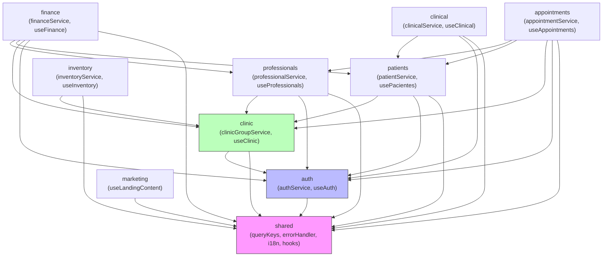

# Fisio Flow Care — Architecture Diagrams

> Visual reference for the system architecture, module relationships, data flow, and database structure.
> Diagrams use ASCII art (universally renderable) and Mermaid (render with GitHub / Mermaid Live Editor).

---

## 1. Full System Architecture

```
╔══════════════════════════════════════════════════════════════════════════════════╗
║                            BROWSER / PWA                                        ║
║                                                                                  ║
║  ┌─────────────────────────────────────────────────────────────────────────┐    ║
║  │                         React Application                                │    ║
║  │                                                                           │    ║
║  │  ┌──────────────────────────────────────────────────────────────────┐   │    ║
║  │  │  Provider Stack (App.tsx)                                         │   │    ║
║  │  │  ThemeProvider → QueryClientProvider → TooltipProvider →          │   │    ║
║  │  │  I18nProvider → AuthProvider → ClinicProvider                     │   │    ║
║  │  └──────────────────────┬───────────────────────────────────────────┘   │    ║
║  │                          │                                                │    ║
║  │  ┌───────────┐   ┌───────┴────────┐   ┌──────────────────────────────┐ │    ║
║  │  │ BrowserRouter│  │   ErrorBoundary │   │        Suspense              │ │    ║
║  │  │  65 routes │   │                 │   │   LazyLoadFallback           │ │    ║
║  │  └─────┬─────┘   └───────┬────────┘   └──────────────────────────────┘ │    ║
║  │        │                  │                                                │    ║
║  │  ┌─────▼──────────────────▼────────────────────────────────────────────┐ │    ║
║  │  │  Route Tree                                                           │ │    ║
║  │  │  Public: /login, /paciente-access, /onboarding/:id, /site, /         │ │    ║
║  │  │  Protected (ProtectedRoute + AppLayout):                              │ │    ║
║  │  │    /dashboard, /pacientes/*, /agenda, /profissionais,                 │ │    ║
║  │  │    /financeiro, /configuracoes, /inventario, ...                      │ │    ║
║  │  └──────────────────────────────────────────────────────────────────────┘ │    ║
║  │                                                                           │    ║
║  │  ┌──────────────────────────────────────────────────────────────────┐   │    ║
║  │  │  AppLayout                                                         │   │    ║
║  │  │  ┌────────────────┐   ┌────────────────────────────────────────┐  │   │    ║
║  │  │  │  AppSidebar    │   │             Page Component              │  │   │    ║
║  │  │  │  6 nav groups  │   │  Uses domain hooks → service layer      │  │   │    ║
║  │  │  └────────────────┘   └────────────────────────────────────────┘  │   │    ║
║  │  └──────────────────────────────────────────────────────────────────┘   │    ║
║  └─────────────────────────────────────────────────────────────────────────┘    ║
╚══════════════════════════════════════════════════════════════════════════════════╝
                                        │
                    ┌───────────────────┼───────────────────┐
                    │                   │                   │
                    ▼                   ▼                   ▼
         ┌──────────────────┐  ┌──────────────┐  ┌──────────────────┐
         │   PostgreSQL DB   │  │  Supabase    │  │  Supabase        │
         │   82 tables       │  │  Auth (JWT)  │  │  Storage         │
         │   RLS on all      │  │              │  │  (attachments)   │
         └──────────────────┘  └──────────────┘  └──────────────────┘
```

---

## 2. Frontend Layered Architecture

```
┌─────────────────────────────────────────────────────────────────┐
│  LAYER 5 — Pages  (src/pages/)                                   │
│  Route-level components. Compose hooks + UI only.                │
│  Example: Dashboard.tsx, Agenda.tsx, PacienteForm.tsx            │
├─────────────────────────────────────────────────────────────────┤
│  LAYER 4 — Components  (src/components/ + modules/*/components/)│
│  Reusable UI. Call hooks; never call services or Supabase.       │
│  Example: AppSidebar, PatientCard, ClinicUnitSelector            │
├─────────────────────────────────────────────────────────────────┤
│  LAYER 3 — Domain Hooks  (src/modules/*/hooks/)                  │
│  React Query hooks. Own the cache. Return typed data + mutators. │
│  Example: usePacientes, useAppointments, useFinance              │
├─────────────────────────────────────────────────────────────────┤
│  LAYER 2 — Service Layer  (src/modules/*/services/)              │
│  Pure async functions. ONLY layer that imports Supabase client.  │
│  Named column selects. Explicit TypeScript return types.         │
│  Example: patientService, appointmentService, financeService     │
├─────────────────────────────────────────────────────────────────┤
│  LAYER 1 — Integration  (src/integrations/supabase/)             │
│  Auto-generated Supabase client + Database<> type definitions.   │
│  Never imported above the service layer.                         │
└─────────────────────────────────────────────────────────────────┘
```

---

## 3. Module Dependency Diagram (Mermaid)



---

## 4. React Component Hierarchy

```
App
├── ThemeProvider / QueryClientProvider / TooltipProvider
│   └── I18nProvider
│       └── AuthProvider
│           └── ClinicProvider
│               └── BrowserRouter
│                   ├── ErrorBoundary
│                   └── Suspense
│                       └── Routes
│                           ├── /login          → Login
│                           ├── /paciente-access → PacienteAccess
│                           ├── /onboarding/:id  → PatientOnboarding
│                           ├── /site            → LandingPage
│                           ├── /                → Index (redirect)
│                           └── ProtectedRoute
│                               └── AppLayout
│                                   ├── AppSidebar
│                                   │   ├── NavGroup: Pacientes
│                                   │   ├── NavGroup: Agendamentos
│                                   │   ├── NavGroup: Profissionais
│                                   │   ├── NavGroup: Financeiro
│                                   │   ├── NavGroup: Clínica
│                                   │   └── NavGroup: Configurações
│                                   └── <Outlet /> (page content)
│                                       ├── /dashboard           → DashboardToggle
│                                       │   ├── Dashboard         (admin/gestor/secretario)
│                                       │   ├── ProfessionalDashboard
│                                       │   ├── PatientDashboard
│                                       │   └── MasterPanel
│                                       ├── /pacientes           → Pacientes
│                                       ├── /pacientes/novo      → PacienteForm
│                                       ├── /pacientes/:id       → PacienteForm
│                                       ├── /pacientes/:id/detalhes → PacienteDetalhes
│                                       ├── /agenda              → Agenda
│                                       ├── /minha-agenda        → MinhaAgenda
│                                       ├── /disponibilidade     → DisponibilidadeProfissional
│                                       ├── /financeiro          → Financeiro
│                                       ├── /profissionais       → Profissionais
│                                       └── ... (55 more routes)
```

---

## 5. Authentication Flow

```
User visits protected route
         │
         ▼
   ProtectedRoute
         │
   Auth loading?──yes──► <LoadingSpinner />
         │no
   session valid?──no──► Navigate to /login
         │yes
   clinic selected?──no──► Navigate to /selecionar-clinica
         │yes
         ▼
   <AppLayout> rendered
```

**Login sequence:**
```
LoginForm.onSubmit(email, password)
  └─► authService.signIn(email, password)
        └─► supabase.auth.signInWithPassword()
              └─► onAuthStateChange event fires
                    └─► AuthProvider.loadUserData(userId)
                          ├─► authService.getProfile(userId)
                          ├─► authService.getPatientId(userId)
                          ├─► authService.getRoles(userId)
                          └─► authService.getPermissions(userId)
                                └─► AuthContext updated
                                      └─► React re-render → redirect
```

---

## 6. Data Fetch Flow (React Query)

```
Page component mounts
  └─► calls usePacientes(clinicId)
        └─► useQuery({ queryKey: queryKeys.patients.list(clinicId) })
              └─► queryFn: patientService.getPatients({ activeClinicId })
                    └─► supabase.from("pacientes").select(PATIENT_COLUMNS)
                          └─► Supabase PostgreSQL (with RLS check)
                                └─► data returned → React Query cache
                                      └─► component re-renders with data
```

**Mutation flow:**
```
User submits PatientForm
  └─► useMutation({ mutationFn: patientService.createPatient(data) })
        └─► supabase.from("pacientes").insert(data)
              └─► on success: queryClient.invalidateQueries(queryKeys.patients.all)
                    └─► all patient lists re-fetch silently
                          └─► UI updates automatically
```

---

## 7. Database Structure — Domain Groups

```
┌──────────────────────────────────────────────────────────────────────┐
│  IDENTITY & ACCESS                                                    │
│  profiles  user_roles  user_permissions  clinic_users                │
│  auth.users (Supabase managed)                                        │
├──────────────────────────────────────────────────────────────────────┤
│  TENANT                                                               │
│  clinic_groups  clinic_group_members  clinicas  clinic_settings       │
│  clinic_subscriptions  planos_clinica                                 │
├──────────────────────────────────────────────────────────────────────┤
│  PATIENTS                                                             │
│  pacientes  planos  pagamentos  patient_achievements  patient_goals   │
│  patient_devices                                                      │
├──────────────────────────────────────────────────────────────────────┤
│  SCHEDULING                                                           │
│  agendamentos  disponibilidade_profissional  bloqueios_profissional   │
│  weekly_schedules  schedule_slots  availability_slots  modalidades    │
│  grupo_sessoes  grupo_participantes  teleconsultas                    │
├──────────────────────────────────────────────────────────────────────┤
│  CLINICAL                                                             │
│  evolutions  evaluations  documentos_clinicos  patient_attachments   │
│  planos_exercicios  exercicios_plano                                  │
├──────────────────────────────────────────────────────────────────────┤
│  FINANCE                                                              │
│  pagamentos  expenses  commissions  config_pix  formas_pagamento      │
│  regras_comissao  convenios  nfe_configs                              │
├──────────────────────────────────────────────────────────────────────┤
│  PROFESSIONALS                                                        │
│  profissional_formacoes  profissional_certificados                   │
│  professional_goals  professional_kpis  regras_comissao               │
├──────────────────────────────────────────────────────────────────────┤
│  INVENTORY                                                            │
│  produtos  equipamentos  entradas_estoque  reservas_produtos          │
├──────────────────────────────────────────────────────────────────────┤
│  COMMUNICATION                                                        │
│  mensagens  avisos  automacoes  notificacoes                          │
├──────────────────────────────────────────────────────────────────────┤
│  MARKETING & ANALYTICS                                                │
│  landing_content  marketing_campaigns  audit_logs                    │
└──────────────────────────────────────────────────────────────────────┘
```

---

## 8. Multi-Tenant Isolation Model

```
                     clinic_groups
                          │
                  ┌───────┴────────┐
                  │                │
              clinicas A       clinicas B
                  │                │
         ┌────────┘                └────────┐
         │                                  │
    clinic_users                       clinic_users
    (user ↔ clinic)                    (user ↔ clinic)
         │                                  │
    agendamentos                       agendamentos
    (clinic_id = A)                    (clinic_id = B)

Cross-group:  patients can be cross-booked if clinicas.clinic_group_id matches
RLS guard:    user_in_clinic_group(_clinic_group_id) DB function enforced in policies
```

---

## 9. State Management Overview

```
┌──────────────────────────────────────────────────────────────────┐
│  REACT CONTEXT (global, synchronous, small)                       │
│  ┌───────────────────┐  ┌──────────────────┐                     │
│  │  AuthContext       │  │  ClinicContext    │                     │
│  │  user, session,    │  │  activeClinicId,  │                     │
│  │  profile, roles,   │  │  clinics list,    │                     │
│  │  permissions       │  │  switchClinic()   │                     │
│  └───────────────────┘  └──────────────────┘                     │
├──────────────────────────────────────────────────────────────────┤
│  REACT QUERY (async, cached, server-synchronised)                 │
│  Holds all remote data: patients, appointments, finance, etc.     │
│  Keys centralised in queryKeys.ts (40+ keys)                      │
│  Invalidation on mutations → automatic refetch                    │
├──────────────────────────────────────────────────────────────────┤
│  COMPONENT STATE (local, ephemeral)                               │
│  Form state via React Hook Form + Zod                             │
│  Modal open/close, active tab, filter selections                  │
│  Complex form state extracted to custom hooks (e.g. usePatientForm)│
└──────────────────────────────────────────────────────────────────┘
```
