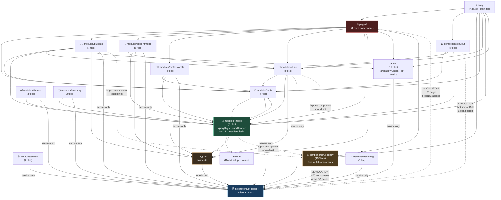
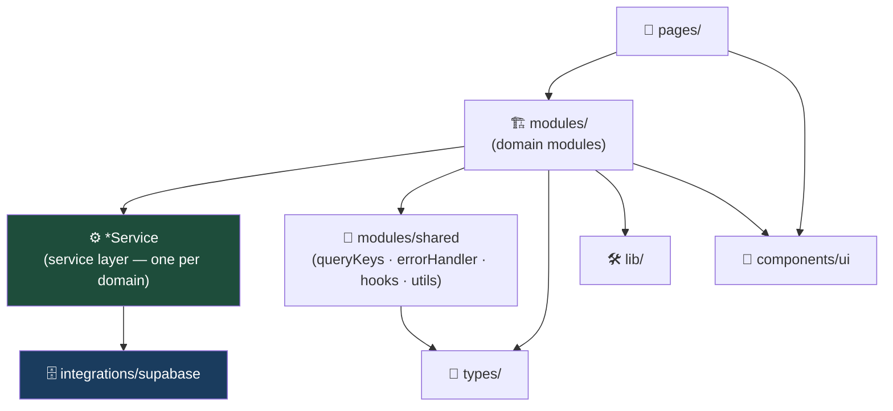

# Fisio Flow Care — Module Dependency Map

> Generated: 2026-03-14 · Source: `src/` (376 files across 17 domain buckets)

---

## 1. High-Level Architecture Overview

The project is structured around a set of **domain modules** (`src/modules/*`),
a shared UI component tree (`src/components/*`), route-level page components
(`src/pages/*`), and a Supabase integration layer (`src/integrations/supabase`).

```
src/
├── modules/              ← domain modules (services · hooks · utils · types)
│   ├── auth/             (4 files)
│   ├── appointments/     (6 files)
│   ├── patients/         (7 files)
│   ├── professionals/    (4 files)
│   ├── clinic/           (8 files)
│   ├── clinical/         (2 files)
│   ├── finance/          (3 files)
│   ├── inventory/        (2 files)
│   ├── marketing/        (1 file)
│   └── shared/           (9 files)  ← queryKeys, errorHandler, i18n adapter, …
├── components/
│   ├── layout/           (7 files)  ← AppLayout, AppSidebar, …
│   └── (ui-legacy)       (137 files) ← feature components not yet in modules
├── pages/                (64 files) ← route components
├── integrations/supabase (2 files)  ← Supabase client + generated types
├── types/                (1 file)   ← shared entity types
├── lib/                  (17 files) ← utilities & helpers
├── i18n/                 (2 files)  ← i18next setup + locale files
└── entry (App.tsx · main.tsx)
```

---

## 2. Inter-Domain Dependency Graph (Mermaid)

> **Reading key:** An arrow `A --> B` means "A imports from B".
> Arrows to `integrations/supabase` that bypass the service layer are shown in **red**.



---

## 3. Service Layer Dependency Detail

Each domain module's service is the **only** file that should import from Supabase.
The table below shows the current state:

| Module | Service file | Imports Supabase? | Uses COLUMN constants? | Typed returns? |
|---|---|---|---|---|
| auth | `modules/auth/services/authService.ts` | ✅ yes (correct) | — | ✅ |
| patients | `modules/patients/services/patientService.ts` | ✅ yes (correct) | ✅ `PATIENT_COLUMNS` | ✅ |
| appointments | `modules/appointments/services/appointmentService.ts` | ✅ yes (correct) | ✅ explicit columns | ✅ |
| professionals | `modules/professionals/services/professionalService.ts` | ✅ yes (correct) | ✅ `PROFESSIONAL_COLUMNS` | ✅ |
| clinic | `modules/clinic/services/clinicGroupService.ts` | ✅ yes (correct) | ✅ | ✅ |
| clinical | `modules/clinical/services/clinicalService.ts` | ✅ yes (correct) | ✅ `EVOLUTION_COLUMNS` | ✅ |
| finance | `modules/finance/services/financeService.ts` | ✅ yes (correct) | ✅ explicit columns | ✅ |
| inventory | `modules/inventory/services/inventoryService.ts` | ✅ yes (correct) | ✅ | ✅ |
| marketing | `modules/marketing/hooks/useLandingContent.ts` | ✅ yes (correct) | ✅ | ✅ |
| shared | `modules/shared/services/auditService.ts` | ✅ yes (correct) | ✅ | ✅ |

---

## 4. Architecture Violation Catalogue

### 4.1 Direct Supabase Access Outside Services

The following **110 non-service files** import directly from
`@/integrations/supabase/client`, bypassing the service layer.
They are ranked by number of direct `.supabase` call-sites.

#### Critical (≥ 10 call-sites)

| File | Direct calls |
|---|---|
| `pages/SolicitacoesAlteracao.tsx` | 30 |
| `pages/DisponibilidadeProfissional.tsx` | 22 |
| `pages/MasterPanel.tsx` | 21 |
| `pages/Dashboard.tsx` | 18 |
| `components/profissionais/CommissionExtract.tsx` | 14 |
| `pages/DocumentosClinicos.tsx` | 13 |
| `pages/Produtos.tsx` | 13 |
| `pages/Teleconsulta.tsx` | 13 |
| `pages/Matriculas.tsx` | 12 |
| `pages/NotasFiscais.tsx` | 12 |
| `components/master/ManualTab.tsx` | 11 |
| `modules/patients/hooks/usePatientForm.tsx` | 11 |
| `modules/professionals/hooks/useProfessionalAnalytics.ts` | 10 |

#### High (5 – 9 call-sites)

| File | Direct calls |
|---|---|
| `pages/Contratos.tsx` | 10 |
| `pages/PerfilProfissional.tsx` | 10 |
| `components/dashboard/RequestsCard.tsx` | 9 |
| `components/master/ClinicDetailDialog.tsx` | 9 |
| `pages/Comissoes.tsx` | 9 |
| `components/profissionais/CommissionRules.tsx` | 8 |
| `pages/Convenios.tsx` | 8 |
| `pages/ImportacaoMassa.tsx` | 8 |
| `pages/MeusPlanos.tsx` | 8 |
| `pages/PlanosExercicios.tsx` | 8 |
| `components/admin/FichaRequestsPanel.tsx` | 7 |
| `components/layout/NotificationBell.tsx` | 7 |
| `components/patient/ExportPatientPDFButton.tsx` | 7 |
| `pages/GestaoClinicas.tsx` | 7 |
| `pages/RelatoriosContent.tsx` | 7 |
| `components/agenda/RescheduleDialog.tsx` | 6 |
| `components/clinical/EvolutionForm.tsx` | 6 |
| `components/master/MasterMarketingTab.tsx` | 6 |
| `pages/Inteligencia.tsx` | 6 |
| `pages/Marketing.tsx` | 6 |
| `pages/MensagensInternas.tsx` | 6 |
| `pages/Profissionais.tsx` | 6 |
| `pages/VacancyCalendar.tsx` | 6 |
| `components/lista-espera/AddEntryDialog.tsx` | 5 |
| `components/onboarding/AdminOnboardingWizard.tsx` | 5 |
| `components/patient/AIPatientAnalysisButton.tsx` | 5 |
| `pages/ClinicSettings.tsx` | 5 |
| `pages/Indicadores.tsx` | 5 |
| `pages/PreCadastrosAdmin.tsx` | 5 |

#### Medium (2 – 4 call-sites) — 40 files

`components/clinical/AIClinicalAssistant.tsx`,
`components/enrollments/CancellationPolicies.tsx`,
`components/gamification/RewardsCatalogAdmin.tsx`,
`components/intelligence/OccupancyReport.tsx`,
`components/matriculas/MatriculaPayments.tsx`,
`components/patient/PatientEvolutionsTab.tsx`,
`pages/Automacoes.tsx`, `pages/AvisosAdmin.tsx`,
`pages/Equipamentos.tsx`, `pages/Financeiro.tsx`,
`pages/GamificationAdminPanel.tsx`, `pages/MetasGamificacao.tsx`,
`pages/Pacientes.tsx`,
`components/agenda/AgendamentoForm.tsx`,
`components/clinical/PatientAttachments.tsx`,
`components/gamification/AISuggestionsPanel.tsx`,
`components/intelligence/ChurnPrediction.tsx`,
`components/layout/GlobalSearch.tsx`,
`components/lista-espera/ScheduleChangeApprovals.tsx`,
`components/planos/PlanoFormDialog.tsx`,
`components/reports/FinanceDashboard.tsx`,
`components/reports/ReengagementCampaign.tsx`,
`pages/Despesas.tsx`,
`components/enrollments/EnrollmentForm.tsx`,
`components/lista-espera/WaitingListTab.tsx`,
`components/profissionais/UserRoleManager.tsx`,
`components/reports/CommissionReport.tsx`,
`components/ui/image-upload.tsx`,
`modules/appointments/hooks/useCrossBooking.ts`,
`modules/auth/hooks/useAuth.tsx`,
`pages/MeuPerfil.tsx`, `pages/PacienteAccess.tsx`, `pages/Prontuarios.tsx`

#### Low (1 call-site) — 37 files

`components/clinical/EvaluationForm.tsx`,
`components/contracts/DigitalContractDialog.tsx`,
`components/dashboard/DailyTipsCard.tsx`,
`components/enrollments/EnrollmentAdminPanel.tsx`,
`components/enrollments/EnrollmentDetails.tsx`,
`components/enrollments/RescheduleDialog.tsx`,
`components/intelligence/AIChurnSuggestions.tsx`,
`components/landing/ContactSection.tsx`,
`components/lista-espera/AIWaitingListPriority.tsx`,
`components/marketing/LandingSiteEditor.tsx`,
`components/marketing/MarketingImageGenerator.tsx`,
`components/metas/MetasClinicaForm.tsx`,
`components/patient/FichaRequestButton.tsx`,
`components/patient/NpsSurvey.tsx`,
`components/patient/PatientChatbot.tsx`,
`components/planos/PlanoSessoesDialog.tsx`,
`components/professional/AIInsightsPanel.tsx`,
`components/reports/AIKpiInsights.tsx`,
`components/reports/ClinicReportButton.tsx`,
`components/reports/NpsAdminPanel.tsx`,
`components/settings/BackupExport.tsx`,
`modules/appointments/hooks/useModalidades.ts`,
`modules/clinic/hooks/usePlanLimits.ts`,
`modules/patients/hooks/useGamification.ts`,
`pages/Agenda.tsx`, `pages/Aniversariantes.tsx`,
`pages/DicasDiarias.tsx`, `pages/ListaEspera.tsx`,
`pages/MeusPagamentos.tsx`, `pages/MinhaAgenda.tsx`,
`pages/PatientDashboard.tsx`, `pages/PatientOnboarding.tsx`,
`pages/PerfilProfissionalPublico.tsx`, `pages/PreCadastro.tsx`,
`pages/ResetPassword.tsx`

### 4.2 Cross-Module Coupling Issues

| From | Imports | Issue |
|---|---|---|
| `modules/clinic` | `components/ui-legacy` (ClinicUnitSelector) | Module should not import legacy UI layer |
| `modules/patients` | `components/ui-legacy` (usePatientForm) | Hook imports UI components directly |
| `modules/shared` | `components/ui-legacy` | Shared module depends on legacy UI |

---

## 5. Ideal Target Architecture

The diagram below shows the **desired** dependency flow — strict layering with no
upward or lateral violations:



**Rules:**
1. `pages/*` → consumes domain hooks/services only, **never** imports Supabase directly
2. `modules/*/hooks/*` → calls its module's service, **never** imports Supabase directly
3. `modules/*/components/*` → calls its module's hook, **never** imports Supabase directly
4. `modules/*/services/*` → the **only** file that may import from `integrations/supabase/client`
5. `modules/shared/*` → zero dependency on `integrations/supabase`
6. `components/ui/*` → zero dependency on any module or service

---

## 6. Recommended Migration Priority

Based on violation count and business criticality:

| Priority | File / Group | Action |
|---|---|---|
| 🔴 P0 | `pages/Dashboard.tsx` (18 calls) | Extract `dashboardService.ts` |
| 🔴 P0 | `pages/DisponibilidadeProfissional.tsx` (22 calls) | Extract `availabilityService.ts` |
| 🔴 P0 | `pages/SolicitacoesAlteracao.tsx` (30 calls) | Extract `changeRequestService.ts` |
| 🔴 P0 | `pages/MasterPanel.tsx` (21 calls) | Extract `masterService.ts` |
| 🟠 P1 | `modules/patients/hooks/usePatientForm.tsx` (11 calls) | Move writes to `patientService.ts` |
| 🟠 P1 | `modules/professionals/hooks/useProfessionalAnalytics.ts` (10 calls) | Move to `professionalService.ts` |
| 🟠 P1 | `components/profissionais/CommissionExtract.tsx` (14 calls) | Extract `commissionService.ts` |
| 🟡 P2 | `components/layout/NotificationBell.tsx` / `GlobalSearch.tsx` | Move queries to shared service |
| 🟡 P2 | 40 medium-severity components | Batch migration to existing services |
| 🟢 P3 | 37 low-severity files (1 call each) | Final cleanup pass |

---

## 7. React Query Key Consistency

All hooks **must** use the centralized key factory:

```ts
// ✅ Correct — use the factory
import { queryKeys } from "@/modules/shared/constants/queryKeys";
queryKey: queryKeys.patients.list(activeClinicId, status)

// ❌ Wrong — inline string arrays
queryKey: ["pacientes", activeClinicId]
```

The factory is at `src/modules/shared/constants/queryKeys.ts` and covers:
`patients` · `appointments` · `professionals` · `finance` · `clinical` · `clinics` · `dashboard`

---

## 8. Summary Statistics

| Metric | Value |
|---|---|
| Total source files | 376 |
| Domain module files (correct layer) | 47 |
| Legacy UI component files | 137 |
| Page components | 64 |
| Files with **direct** Supabase access | 110 |
| Files correctly using service layer | 266 |
| Architecture compliance | **71%** |
| Test files | 34 |
| Total tests | 372 |
